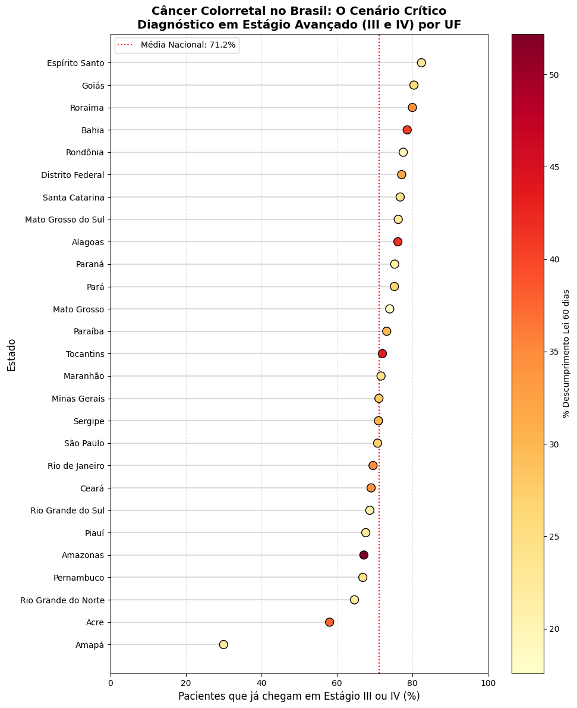

# Public Policy Compliance & Clinical Outcomes: The "60-Day Law" Case in Brazil (Colorectal Cancer)

## 🩺 Clinical Context
In Brazil, **Law 12.732/2012** (known as the "60-Day Law") mandates that patients diagnosed with malignant neoplasia must begin their first treatment within the **Public Health System (SUS)** no later than 60 days after the diagnosis is confirmed.

This project evaluates the compliance with this legislation for **Colorectal Cancer (CRC)** between 2023 and 2025, cross-referencing healthcare efficiency with clinical staging.

## 📊 Key Analytical Insights
* **Screening Bottleneck:** Over **70%** of patients across nearly all Brazilian states initiate treatment already at **Stage III or IV**, highlighting critical failures in early detection and primary care screening.
* **Regional Disparities:** Northern states, such as **Amazonas**, show law non-compliance rates exceeding **50%**, indicating a severe geographic gap in oncology infrastructure.
* **The Statistical Paradox:** A Pearson correlation coefficient of **0.04** between treatment delay and staging suggests that disease severity is chronically high regardless of the immediate hospital wait time. This implies that the patient's prognosis is often compromised before they even enter the specialized oncological system, suggesting that screening is currently inefficient

* 
* 

## 🛠️ Technologies & Methodology
* **Language:** Python 3.x
* **Data Libraries:** * `Pandas`: Data cleaning, manipulation, and merging of multiple administrative datasets.
  * `Seaborn` & `Matplotlib`: Advanced visualizations (Lollipop Charts and Linear Regression).
  * `Regex`: String cleaning and standardization of Brazilian State (UF) nomenclature.
* **Approach:** Integration of time-to-treatment metrics with clinical staging distributions to identify systemic public health gaps.

## 📁 Data Source
The raw microdata was extracted from **DATASUS** (Brazilian Ministry of Health), specifically from the **Oncology Panel (SIA/SUS)**. The analysis includes:
1. Total CRC cases by state of residence.
2. Cases with treatment initiation exceeding 60 days.
3. Pathological staging at the time of diagnosis.
